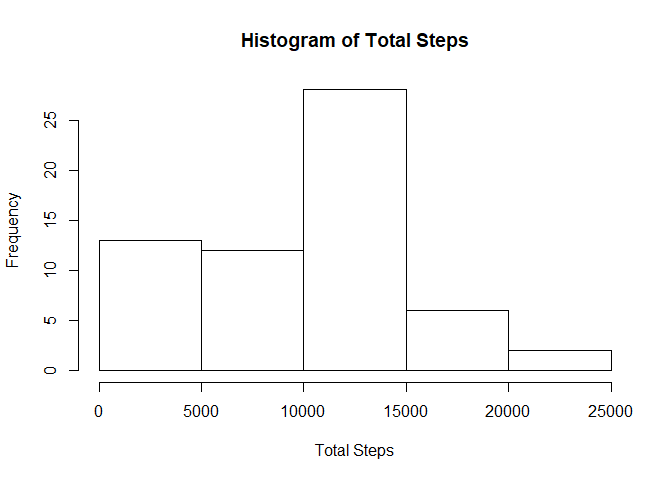
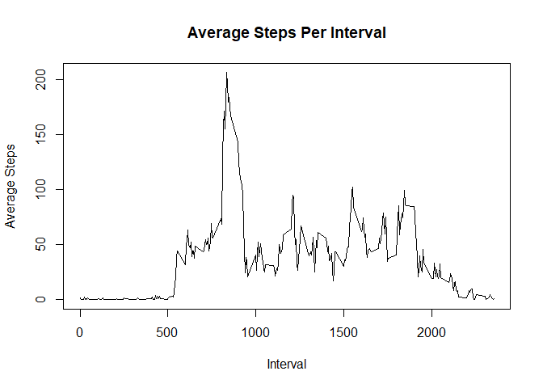
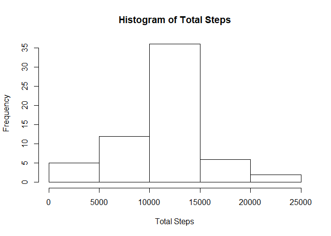
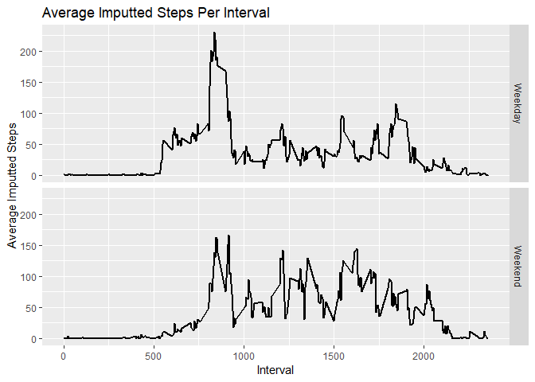

```r
library(knitr)
opts_chunk$set(echo = TRUE, results = "asis")
```

## Loading and preprocessing the data


```r
if(!file.exists("activity.csv")){
    unzip("activity.zip")
}

data <- read.csv("activity.csv")
```

## What is mean total number of steps taken per day?

1. Calculate the total number of steps taken per day


```r
groupdata<- aggregate(data$steps, list(data$date), sum, na.rm=TRUE)
kable(groupdata, 
      col.names = c("Date", "Total Steps"), align = 'l', 
      caption = "Total Steps Per Day")
```


Table: Total Steps Per Day

Date         Total Steps 
-----------  ------------
2012-10-01   0           
2012-10-02   126         
2012-10-03   11352       
2012-10-04   12116       
2012-10-05   13294       
2012-10-06   15420       
2012-10-07   11015       
2012-10-08   0           
2012-10-09   12811       
2012-10-10   9900        
2012-10-11   10304       
2012-10-12   17382       
2012-10-13   12426       
2012-10-14   15098       
2012-10-15   10139       
2012-10-16   15084       
2012-10-17   13452       
2012-10-18   10056       
2012-10-19   11829       
2012-10-20   10395       
2012-10-21   8821        
2012-10-22   13460       
2012-10-23   8918        
2012-10-24   8355        
2012-10-25   2492        
2012-10-26   6778        
2012-10-27   10119       
2012-10-28   11458       
2012-10-29   5018        
2012-10-30   9819        
2012-10-31   15414       
2012-11-01   0           
2012-11-02   10600       
2012-11-03   10571       
2012-11-04   0           
2012-11-05   10439       
2012-11-06   8334        
2012-11-07   12883       
2012-11-08   3219        
2012-11-09   0           
2012-11-10   0           
2012-11-11   12608       
2012-11-12   10765       
2012-11-13   7336        
2012-11-14   0           
2012-11-15   41          
2012-11-16   5441        
2012-11-17   14339       
2012-11-18   15110       
2012-11-19   8841        
2012-11-20   4472        
2012-11-21   12787       
2012-11-22   20427       
2012-11-23   21194       
2012-11-24   14478       
2012-11-25   11834       
2012-11-26   11162       
2012-11-27   13646       
2012-11-28   10183       
2012-11-29   7047        
2012-11-30   0           

2. Make a histogram of the total number of steps taken each day


```r
hist(groupdata$x, xlab="Total Steps", main="Histogram of Total Steps")
```

<!-- -->

3.Calculate and report the mean and median of the total number of steps taken per day


```r
groupdata <- aggregate(data$steps, list(data$date), mean, na.rm=TRUE)
kable(groupdata, 
      col.names = c("Date", "Average Steps"), align = 'l', 
      caption = "Avg. Steps Per Day")
```


Table: Avg. Steps Per Day

Date         Average Steps 
-----------  --------------
2012-10-01   NaN           
2012-10-02   0.4375000     
2012-10-03   39.4166667    
2012-10-04   42.0694444    
2012-10-05   46.1597222    
2012-10-06   53.5416667    
2012-10-07   38.2465278    
2012-10-08   NaN           
2012-10-09   44.4826389    
2012-10-10   34.3750000    
2012-10-11   35.7777778    
2012-10-12   60.3541667    
2012-10-13   43.1458333    
2012-10-14   52.4236111    
2012-10-15   35.2048611    
2012-10-16   52.3750000    
2012-10-17   46.7083333    
2012-10-18   34.9166667    
2012-10-19   41.0729167    
2012-10-20   36.0937500    
2012-10-21   30.6284722    
2012-10-22   46.7361111    
2012-10-23   30.9652778    
2012-10-24   29.0104167    
2012-10-25   8.6527778     
2012-10-26   23.5347222    
2012-10-27   35.1354167    
2012-10-28   39.7847222    
2012-10-29   17.4236111    
2012-10-30   34.0937500    
2012-10-31   53.5208333    
2012-11-01   NaN           
2012-11-02   36.8055556    
2012-11-03   36.7048611    
2012-11-04   NaN           
2012-11-05   36.2465278    
2012-11-06   28.9375000    
2012-11-07   44.7326389    
2012-11-08   11.1770833    
2012-11-09   NaN           
2012-11-10   NaN           
2012-11-11   43.7777778    
2012-11-12   37.3784722    
2012-11-13   25.4722222    
2012-11-14   NaN           
2012-11-15   0.1423611     
2012-11-16   18.8923611    
2012-11-17   49.7881944    
2012-11-18   52.4652778    
2012-11-19   30.6979167    
2012-11-20   15.5277778    
2012-11-21   44.3993056    
2012-11-22   70.9270833    
2012-11-23   73.5902778    
2012-11-24   50.2708333    
2012-11-25   41.0902778    
2012-11-26   38.7569444    
2012-11-27   47.3819444    
2012-11-28   35.3576389    
2012-11-29   24.4687500    
2012-11-30   NaN           

```r
groupdata <- aggregate(data$steps, list(data$date), median, na.rm=TRUE)
kable(groupdata, 
      col.names = c("Date", "Median Steps"), align = 'l', 
      caption = "Median Steps Per Day")
```


Table: Median Steps Per Day

Date         Median Steps 
-----------  -------------
2012-10-01   NA           
2012-10-02   0            
2012-10-03   0            
2012-10-04   0            
2012-10-05   0            
2012-10-06   0            
2012-10-07   0            
2012-10-08   NA           
2012-10-09   0            
2012-10-10   0            
2012-10-11   0            
2012-10-12   0            
2012-10-13   0            
2012-10-14   0            
2012-10-15   0            
2012-10-16   0            
2012-10-17   0            
2012-10-18   0            
2012-10-19   0            
2012-10-20   0            
2012-10-21   0            
2012-10-22   0            
2012-10-23   0            
2012-10-24   0            
2012-10-25   0            
2012-10-26   0            
2012-10-27   0            
2012-10-28   0            
2012-10-29   0            
2012-10-30   0            
2012-10-31   0            
2012-11-01   NA           
2012-11-02   0            
2012-11-03   0            
2012-11-04   NA           
2012-11-05   0            
2012-11-06   0            
2012-11-07   0            
2012-11-08   0            
2012-11-09   NA           
2012-11-10   NA           
2012-11-11   0            
2012-11-12   0            
2012-11-13   0            
2012-11-14   NA           
2012-11-15   0            
2012-11-16   0            
2012-11-17   0            
2012-11-18   0            
2012-11-19   0            
2012-11-20   0            
2012-11-21   0            
2012-11-22   0            
2012-11-23   0            
2012-11-24   0            
2012-11-25   0            
2012-11-26   0            
2012-11-27   0            
2012-11-28   0            
2012-11-29   0            
2012-11-30   NA           

## What is the average daily activity pattern?

1. Make a time series plot of the 5-minute interval and the average number of steps taken, averaged across all days


```r
groupdata <- aggregate(data$steps, list(data$interval), mean, na.rm=TRUE)
with(groupdata, plot(Group.1, x, type = "l", xlab = "Interval", 
                     ylab = "Average Steps", 
                     main = "Average Steps Per Interval"))
```

<!-- -->

2. Which 5-minute interval, on average across all the days in the dataset, contains the maximum number of steps?


```r
print(paste("Interval ", groupdata[which.max(groupdata$x),1], " is the maximum interval with average steps of ", groupdata[which.max(groupdata$x),2]))
```

[1] "Interval  835  is the maximum interval with average steps of  206.169811320755"

## Imputing missing values

1. Calculate and report the total number of missing values in the dataset


```r
missing <- is.na(data$steps)
print(paste("Number of missing values = ", sum(missing)))
```

[1] "Number of missing values =  2304"

2. Devise a strategy for filling in all of the missing values in the dataset.

Strategy used is to fill the missing values with the mean for that 5-minute interval

3. Create a new dataset that is equal to the original dataset but with the missing data filled in.


```r
imputdata <- data
names(groupdata) <- c("interval", "steps")
imputdata <- merge(imputdata, groupdata, by = "interval")
imputdata[is.na(imputdata$steps.x), ]$steps.x <- 
    imputdata[is.na(imputdata$steps.x),]$steps.y
```

4. Make a histogram of the total number of steps taken each day and Calculate and report the mean and median total number of steps taken per day.

Based on the graphs below, there is a significant difference from using the original data versus the data with imputted valeus, causing an increase with the total number of steps.


```r
groupdata<- aggregate(imputdata$steps.x, list(imputdata$date), sum, na.rm=TRUE)
hist(groupdata$x, xlab="Total Steps", main="Histogram of Total Steps")
```

<!-- -->

```r
groupdata <- aggregate(imputdata$steps.x, list(imputdata$date), mean, na.rm=TRUE)
kable(groupdata, 
      col.names = c("Date", "Average Steps"), align = 'l', 
      caption = "Avg. Imputed Steps Per Day")
```


Table: Avg. Imputed Steps Per Day

Date         Average Steps 
-----------  --------------
2012-10-01   37.3825996    
2012-10-02   0.4375000     
2012-10-03   39.4166667    
2012-10-04   42.0694444    
2012-10-05   46.1597222    
2012-10-06   53.5416667    
2012-10-07   38.2465278    
2012-10-08   37.3825996    
2012-10-09   44.4826389    
2012-10-10   34.3750000    
2012-10-11   35.7777778    
2012-10-12   60.3541667    
2012-10-13   43.1458333    
2012-10-14   52.4236111    
2012-10-15   35.2048611    
2012-10-16   52.3750000    
2012-10-17   46.7083333    
2012-10-18   34.9166667    
2012-10-19   41.0729167    
2012-10-20   36.0937500    
2012-10-21   30.6284722    
2012-10-22   46.7361111    
2012-10-23   30.9652778    
2012-10-24   29.0104167    
2012-10-25   8.6527778     
2012-10-26   23.5347222    
2012-10-27   35.1354167    
2012-10-28   39.7847222    
2012-10-29   17.4236111    
2012-10-30   34.0937500    
2012-10-31   53.5208333    
2012-11-01   37.3825996    
2012-11-02   36.8055556    
2012-11-03   36.7048611    
2012-11-04   37.3825996    
2012-11-05   36.2465278    
2012-11-06   28.9375000    
2012-11-07   44.7326389    
2012-11-08   11.1770833    
2012-11-09   37.3825996    
2012-11-10   37.3825996    
2012-11-11   43.7777778    
2012-11-12   37.3784722    
2012-11-13   25.4722222    
2012-11-14   37.3825996    
2012-11-15   0.1423611     
2012-11-16   18.8923611    
2012-11-17   49.7881944    
2012-11-18   52.4652778    
2012-11-19   30.6979167    
2012-11-20   15.5277778    
2012-11-21   44.3993056    
2012-11-22   70.9270833    
2012-11-23   73.5902778    
2012-11-24   50.2708333    
2012-11-25   41.0902778    
2012-11-26   38.7569444    
2012-11-27   47.3819444    
2012-11-28   35.3576389    
2012-11-29   24.4687500    
2012-11-30   37.3825996    

```r
groupdata <- aggregate(imputdata$steps.x, list(imputdata$date), median, na.rm=TRUE)
kable(groupdata, 
      col.names = c("Date", "Median Steps"), align = 'l', 
      caption = "Median Imputed Steps Per Day")
```


Table: Median Imputed Steps Per Day

Date         Median Steps 
-----------  -------------
2012-10-01   34.11321     
2012-10-02   0.00000      
2012-10-03   0.00000      
2012-10-04   0.00000      
2012-10-05   0.00000      
2012-10-06   0.00000      
2012-10-07   0.00000      
2012-10-08   34.11321     
2012-10-09   0.00000      
2012-10-10   0.00000      
2012-10-11   0.00000      
2012-10-12   0.00000      
2012-10-13   0.00000      
2012-10-14   0.00000      
2012-10-15   0.00000      
2012-10-16   0.00000      
2012-10-17   0.00000      
2012-10-18   0.00000      
2012-10-19   0.00000      
2012-10-20   0.00000      
2012-10-21   0.00000      
2012-10-22   0.00000      
2012-10-23   0.00000      
2012-10-24   0.00000      
2012-10-25   0.00000      
2012-10-26   0.00000      
2012-10-27   0.00000      
2012-10-28   0.00000      
2012-10-29   0.00000      
2012-10-30   0.00000      
2012-10-31   0.00000      
2012-11-01   34.11321     
2012-11-02   0.00000      
2012-11-03   0.00000      
2012-11-04   34.11321     
2012-11-05   0.00000      
2012-11-06   0.00000      
2012-11-07   0.00000      
2012-11-08   0.00000      
2012-11-09   34.11321     
2012-11-10   34.11321     
2012-11-11   0.00000      
2012-11-12   0.00000      
2012-11-13   0.00000      
2012-11-14   34.11321     
2012-11-15   0.00000      
2012-11-16   0.00000      
2012-11-17   0.00000      
2012-11-18   0.00000      
2012-11-19   0.00000      
2012-11-20   0.00000      
2012-11-21   0.00000      
2012-11-22   0.00000      
2012-11-23   0.00000      
2012-11-24   0.00000      
2012-11-25   0.00000      
2012-11-26   0.00000      
2012-11-27   0.00000      
2012-11-28   0.00000      
2012-11-29   0.00000      
2012-11-30   34.11321     

## Are there differences in activity patterns between weekdays and weekends?

1. Create a new factor variable in the dataset with two levels -- "weekday" and "weekend" indicating whether a given date is a weekday or weekend day.


```r
imputdata$factor <- ifelse(weekdays(as.Date(imputdata$date))%in%c("Saturday", "Sunday"), "Weekend", "Weekday")
```

2. Make a panel plot containing a time series plot of the 5-minute interval and the average number of steps taken, averaged across all weekday days or weekend days


```r
library(ggplot2)
groupdata <- aggregate(data$steps, list(data$interval), mean, na.rm=TRUE)
g <- ggplot(imputdata, aes(interval, steps.x)) + labs(x = "Interval", y = "Average Imputted Steps", title = "Average Imputted Steps Per Interval")
g  + stat_summary(fun.y = mean, geom="line", size=1) + facet_grid(factor~.) 
```

<!-- -->
